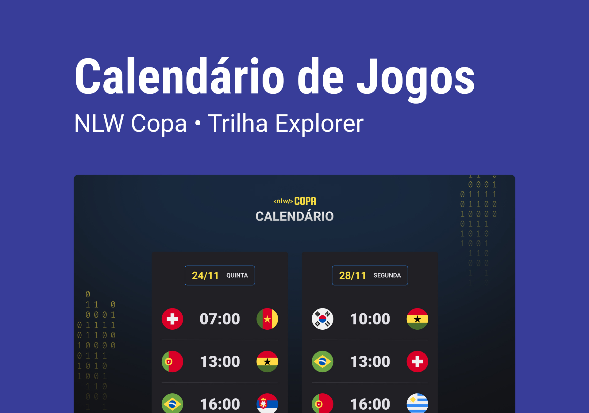

<h1 align="center">
    
</h1>

  Evento exclusivo e gratuito, promovido pela Rocketseat para ensino de tecnologias WEB.

  <a href="#-tecnologias">Tecnologias</a>&nbsp;&nbsp;&nbsp;|&nbsp;&nbsp;&nbsp;
  <a href="#-projeto">Projeto</a>&nbsp;&nbsp;&nbsp;|&nbsp;&nbsp;&nbsp;
  <a href="#-layout">Layout</a>&nbsp;&nbsp;&nbsp;|&nbsp;&nbsp;&nbsp;
  <a href="#-licença">Licença</a>

  

 

  

## 🚀 Tecnologias

Esse projeto foi desenvolvido com as seguintes tecnologias:

- HTML
- CSS
- JavaScript
- Git e Github

## 💻 Projeto

NLW Copa da Rocketseat promovendo a criação de um projeto do calendário dos jogos da Copa 2022 para entrar no clima!

## 🔖 Layout

A partir de um clique no link abaixo você poderá visualizar o projeto por completo, desde que você tenha uma conta no [Figma](http://figma.com/) para acessá-lo.

- [Layout](https://figma.com/file/J1Z33MISC22YZB8wfxiIns/NLW-Copa-Explorer/duplicate)

## Licença

Esse projeto está sob a licença MIT. Veja o arquivo [LICENSE](LICENSE.md) para mais detalhes.
